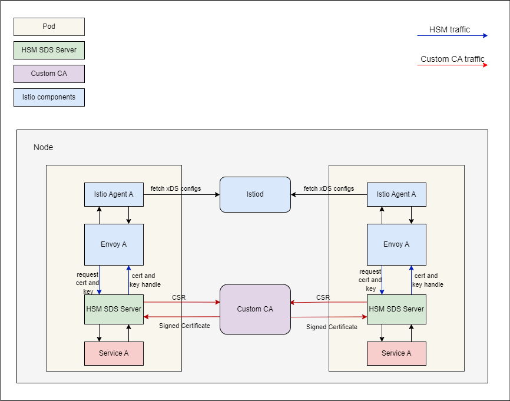

# HSM-SDS-Server

## Introduction

The HSM SDS Server follows the SDS extension standard of Envoy and implements an external SDS server via more secure solution which is known as Hardware Security Module(HSM). By using this repo, User can maintain the credentials for workloads managed by Istio/Envoy in more secure scenario via external SDS server Besides supporting management for new credentials, it also allows user to upload existing credentials and manages them in higher security level. This external SDS server can be used for both gateways and workload sidecars to provide their credential information.

This HSM SDS Server protects service mesh data plane private keys with Intel® SGX. The private keys are stored and used inside the SGX enclave(s) and will never stored in clear anywhere in the system. Authorized applications use the private key in the enclave by key-handle provided by SGX.

## Architecture

### Workload mTLS private key protection:


### Gateway private key protection:
TODO: Add gateway arch diagram.
## Prerequisites

Prerequisites for using Istio mTLS private key protection with SGX:

- Kubernetes cluster with one or more nodes with Intel® [SGX](https://software.intel.com/content/www/us/en/develop/topics/software-guard-extensions.html) supported hardware
- [Intel® SGX device plugin for Kubernetes](https://github.com/intel/intel-device-plugins-for-kubernetes/blob/main/cmd/sgx_plugin/README.md)
- Linux kernel version 5.11 or later on the host (in tree SGX driver)
- [trusted-certificate-issuer](https://github.com/intel/trusted-certificate-issuer)
- [Intel® SGX AESM daemon](https://github.com/intel/linux-sgx#install-the-intelr-sgx-psw)
- [Intel® KMRA service](https://www.intel.com/content/www/us/en/developer/topic-technology/open/key-management-reference-application/overview.html)
> NOTE: The KMRA service and AESM daemon is optional, needs to be set up only when remote attestaion required, which can be set through `NEED_QUOTE` flag in the chart.

## Getting started

This section covers how to install Istio mTLS and gateway private keys protection with SGX
### Create signer

```sh
$ export CA_SIGNER_NAME=sgx-signer
$ cat << EOF | kubectl create -f -
apiVersion: tcs.intel.com/v1alpha1
kind: TCSClusterIssuer
metadata:
    name: $CA_SIGNER_NAME
spec:
    secretName: ${CA_SIGNER_NAME}-secret
    # If using quoteattestaion, set selfSign as false
    # selfSign: false
EOF
```

```sh
# Get CA Cert and replace it in ./deployment/istio-configs/istio-hsm-config.yaml
$ kubectl get secret -n tcs-issuer ${CA_SIGNER_NAME}-secret -o jsonpath='{.data.tls\.crt}' |base64 -d | sed -e 's;\(.*\);        \1;g'
```

### Build image
```sh
$ make docker
```
> NOTE: If you are using containerd as the container runtime, run `make ctr` to build the image instead.
### Protect the private keys of workloads with HSM
1. Install Istio

```sh
$ istioctl install -f ./deployment/istio-configs/istio-hsm-config.yaml -y
```

> NOTE: You can also customize the `istio-hsm-config.yaml` according to your needs. If you want do the quote verification, you should set the `NEED_QUOTE` env as `true`. And if you are using the TCS v1alpha1 api, you can set the `RANDOM_NONCE` as `false`.


2. Verifiy the Istio is ready

By deault, `Istio` will be installed in the `istio-system` namespce

```sh
# Ensure that the pod is running state
$ kubectl get po -n istio-system
NAME                                    READY   STATUS    RESTARTS   AGE
istio-ingressgateway-6cd77bf4bf-t4cwj   1/1     Running   0          70m
istiod-6cf88b78dc-dthpw                 1/1     Running   0          70m
```

3. Create sleep and httpbin deployment:
> NOTE: If you want use the sds-custom injection template, you need to set the annotations `inject.istio.io/templates` for both `sidecar` and `sgx`. And the ClusterRole is also required.
```sh
$ kubectl apply -f <(istioctl kube-inject -f ./deployment/istio-configs/sleep-hsm.yaml )
$ kubectl apply -f <(istioctl kube-inject -f ./deployment/istio-configs/httpbin-hsm.yaml )
```

4. Successful deployment looks like this:

```sh
$ kubectl get po
NAME                       READY   STATUS    RESTARTS   AGE
httpbin-5f6bf4d4d9-5jxj8   3/3     Running   0          30s
sleep-57bc8d74fc-2lw4n     3/3     Running   0          7s
```
5. Test pod resources:

```sh
$ kubectl exec "$(kubectl get pod -l app=sleep -o jsonpath={.items..metadata.name})" -c sleep -- curl -v -s http://httpbin.default:8000/headers | grep X-Forwarded-Client-Cert
    "X-Forwarded-Client-Cert": "By=spiffe://cluster.local/ns/default/sa/httpbin;Hash=2875ce095572f8a12b6080213f7789bfb699099b83e8ea2889a2d7b3eb9523e6;Subject=\"CN=SGX based workload,O=Intel(R) Corporation\";URI=spiffe://cluster.local/ns/default/sa/sleep"

```

The above `httpbin` and `sleep` applications have enabled SGX and store the private keys inside SGX enclave, completed the TLS handshake and established a connection with each other.

```sh
# Dump the envoy config
$ kubectl exec "$(kubectl get pod -l app=sleep -o jsonpath={.items..metadata.name})" -c istio-proxy -- bash 

$ curl localhost:15000/config_dump > envoy_conf.json
```
It can be seen from the config file that the `private_key_provider` configuation has replaced the original private key, and the real private key has been safely stored in the SGX enclave.

### Protect the private keys of gateways with HSM

TODO: Add gateway installation steps.


## Cleaning Up
```sh
# uninstall istio
$ istioctl x uninstall --purge -y
# delete workloads
$ kubectl delete -f ./deployment/istio-configs/sleep-sgx-mTLS.yaml
$ kubectl delete -f ./deployment/istio-configs/httpbin-sgx-mTLS.yaml
```

