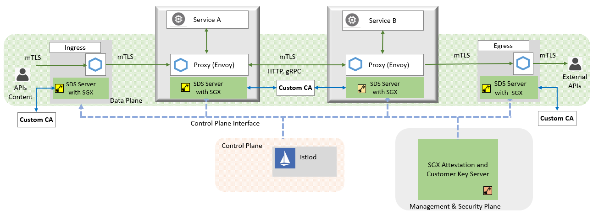

# HSM-SDS-Server

## Introduction

The HSM SDS Server follows the SDS extension standard of Envoy and implements an external SDS server via more secure solution which is known as Hardware Security Module(HSM). By using this repo, User can maintain the credentials for workloads managed by Istio/Envoy in more secure scenario via external SDS server Besides supporting management for new credentials, it also allows user to upload existing credentials and manages them in higher security level. This external SDS server can be used for both gateways and workload sidecars to provide their credential information.

This HSM SDS Server protects service mesh data plane private keys with Intel® SGX. The private keys are stored and used inside the SGX enclave(s) and will never stored in clear anywhere in the system. Authorized applications use the private key in the enclave by key-handle provided by SGX.

## Architecture Overview



The SDS Server can protect the private keys via SGX in 2 scenarios: workloads and gateways in Istio/Envoy, showing as above.

## Prerequisites

Prerequisites for using Istio mTLS private key protection with SGX:

- Kubernetes cluster with one or more nodes with [Intel® SGX](https://software.intel.com/content/www/us/en/develop/topics/software-guard-extensions.html) supported hardware
- [Intel® SGX device plugin for Kubernetes](https://github.com/intel/intel-device-plugins-for-kubernetes/blob/main/cmd/sgx_plugin/README.md)
- Linux kernel version 5.11 or later on the host (in tree SGX driver)
- [trusted-certificate-issuer](https://github.com/intel/trusted-certificate-issuer) (Optional, other Issuers can also be used like cert-manager)
- [Intel® SGX AESM daemon](https://github.com/intel/linux-sgx#install-the-intelr-sgx-psw)
- [Intel® KMRA service](https://www.intel.com/content/www/us/en/developer/topic-technology/open/key-management-reference-application/overview.html)
- [Intel® Linux SGX](https://github.com/intel/linux-sgx) and [cripto-api-toolkit](https://github.com/intel/crypto-api-toolkit) in the host (optional, only needed if you want to build sds-server image locally)
> NOTE: The KMRA service and AESM daemon are also optional, need to be set up only when remote attestation required, which can be set through `NEED_QUOTE` flag in the chart.

## Getting started

This section covers how to install Istio mTLS and gateway private keys protection with SGX
### Create signer

```sh
$ export CA_SIGNER_NAME=sgx-signer
$ cat << EOF | kubectl create -f -
apiVersion: tcs.intel.com/v1alpha1
kind: TCSClusterIssuer
metadata:
    name: $CA_SIGNER_NAME
spec:
    secretName: ${CA_SIGNER_NAME}-secret
    # If using quoteattestaion, set selfSign as false
    # selfSign: false
EOF
```

```sh
# Get CA Cert and replace it in ./deployment/istio-configs/istio-hsm-config.yaml
$ kubectl get secret -n tcs-issuer ${CA_SIGNER_NAME}-secret -o jsonpath='{.data.tls\.crt}' |base64 -d | sed -e 's;\(.*\);        \1;g'
```

### Build image
```sh
$ make docker
```
> NOTE: If you are using containerd as the container runtime, run `make ctr` to build the image instead.
### Protect the private keys of workloads with HSM
1. Install Istio

```sh
$ istioctl install -f ./deployment/istio-configs/istio-hsm-config.yaml -y
```

> NOTE: You can also customize the `istio-hsm-config.yaml` according to your needs. If you want do the quote verification, you should set the `NEED_QUOTE` env as `true`. And if you are using the TCS v1alpha1 api, you can set the `RANDOM_NONCE` as `false`.


2. Verifiy the Istio is ready

By deault, `Istio` will be installed in the `istio-system` namespce

```sh
# Ensure that the pod is running state
$ kubectl get po -n istio-system
NAME                                    READY   STATUS    RESTARTS   AGE
istio-ingressgateway-6cd77bf4bf-t4cwj   1/1     Running   0          70m
istiod-6cf88b78dc-dthpw                 1/1     Running   0          70m
```

3. Create sleep and httpbin deployment:
> NOTE: If you want use the sds-custom injection template, you need to set the annotations `inject.istio.io/templates` for both `sidecar` and `sgx`. And the ClusterRole is also required.
```sh
$ kubectl apply -f <(istioctl kube-inject -f ./deployment/istio-configs/sleep-hsm.yaml )
$ kubectl apply -f <(istioctl kube-inject -f ./deployment/istio-configs/httpbin-hsm.yaml )
```

4. Successful deployment looks like this:

```sh
$ kubectl get po
NAME                       READY   STATUS    RESTARTS   AGE
httpbin-5f6bf4d4d9-5jxj8   3/3     Running   0          30s
sleep-57bc8d74fc-2lw4n     3/3     Running   0          7s
```
5. Test pod resources:

```sh
$ kubectl exec "$(kubectl get pod -l app=sleep -o jsonpath={.items..metadata.name})" -c sleep -- curl -v -s http://httpbin.default:8000/headers | grep X-Forwarded-Client-Cert
    "X-Forwarded-Client-Cert": "By=spiffe://cluster.local/ns/default/sa/httpbin;Hash=2875ce095572f8a12b6080213f7789bfb699099b83e8ea2889a2d7b3eb9523e6;Subject=\"CN=SGX based workload,O=Intel(R) Corporation\";URI=spiffe://cluster.local/ns/default/sa/sleep"

```

The above `httpbin` and `sleep` applications have enabled SGX and store the private keys inside SGX enclave, completed the TLS handshake and established a connection with each other.

```sh
# Dump the envoy config
$ kubectl exec "$(kubectl get pod -l app=sleep -o jsonpath={.items..metadata.name})" -c istio-proxy -- bash 

$ curl localhost:15000/config_dump > envoy_conf.json
```
It can be seen from the config file that the `private_key_provider` configuation has replaced the original private key, and the real private key has been safely stored in the SGX enclave.

### Protect the private keys of gateways with HSM
1. Install Istio

> NOTE: for the below command you need to use the `istioctl` for the `docker.io/intel/istioctl:1.16.1-intel.0` since only that contains Istio manifest enhancements for SGX mTLS.
You can also customize the `intel-istio-sgx-gateway.yaml` according to your needs. If you want do the quote verification, you can set the `NEED_QUOTE` env as `true`. And if you are using the TCS v1alpha1 api, you should set the `RANDOM_NONCE` as `false`.

```sh
istioctl install -f ./deployment/istio-configs/gateway-istio-hsm.yaml -y
```
Note: please execute `kubectl apply -f deployment/istio-configs/gateway-clusterrole.yaml` to make sure that the ingress gateway has enough privilege.

2. Verifiy the pods are running

By deault, `Istio` will be installed in the `istio-system` namespce

```sh
# Ensure that the pods are running state
$ kubectl get pod -n istio-system
NAME                                    READY   STATUS    RESTARTS   AGE
istio-ingressgateway-55f8dbb66c-6qx2s   2/2     Running   0          73s
istiod-65db6d8666-jgmf7                 1/1     Running   0          75s
```

3. Deploy sample application

Create httpbin deployment with gateway CR:
> NOTE: If you want to use the sds-custom injection template, you need to set the annotations `inject.istio.io/templates` for both `sidecar` and `sgx`. And the ClusterRole is also required.
```sh
kubectl apply -f <(istioctl kube-inject -f ./deployment/istio-configs/httpbin-hsm.yaml )
kubectl apply -f <(istioctl kube-inject -f ./deployment/istio-configs/httpbin-gateway.yaml )
```
Successful deployment looks like this:

Verify the httpbin pod:
```sh
$ kubectl get pod -n default
NAME                       READY   STATUS    RESTARTS      AGE
httpbin-7fbf9db8f6-qvqn4   3/3     Running      0         2m27s
```

Verify the gateway CR:
```sh
$ kubectl get gateway -n default
NAME              AGE
testuds-gateway   2m52s
```

Verify the quoteattestation CR:
```sh
$ kubectl get quoteattestations.tcs.intel.com -n default
NAME                                                                            AGE
sgxquoteattestation-istio-ingressgateway-55f8dbb66c-6qx2s-httpbin-testsds-com   4m36s
```
Manually get the quoteattestation name via below command

```sh
$ export QA_NAME=<YOUR QUOTEATTESTATION NAME>
```
4. Prepare credential information:

We use command line tools to read and write the QuoteAttestation manually. You get the tools, `km-attest` and `km-wrap`, provided by the [Intel® KMRA project](https://www.intel.com/content/www/us/en/developer/topic-technology/open/key-management-reference-application/overview.html).

> NOTE: please use release version 2.2.1

```sh
$ mkdir -p $HOME/sgx/gateway
$ export CREDENTIAL=$HOME/sgx/gateway

$ kubectl get quoteattestations.tcs.intel.com -n default $QA_NAME -o jsonpath='{.spec.publicKey}' | base64 -d > $CREDENTIAL/public.key
$ kubectl get quoteattestations.tcs.intel.com -n default $QA_NAME -o jsonpath='{.spec.quote}' | base64 -d > $CREDENTIAL/quote.data
$ km-attest --pubkey $CREDENTIAL/public.key --quote $CREDENTIAL/quote.data

$ openssl req -x509 -sha256 -nodes -days 365 -newkey rsa:2048 -subj '/O=example Inc./CN=example.com' -keyout $CREDENTIAL/example.com.key -out $CREDENTIAL/example.com.crt
$ openssl req -out $CREDENTIAL/httpbin.csr -newkey rsa:2048 -nodes -keyout $CREDENTIAL/httpbin.key -subj "/CN=httpbin.example.com/O=httpbin organization"
$ openssl x509 -req -sha256 -days 365 -CA $CREDENTIAL/example.com.crt -CAkey $CREDENTIAL/example.com.key -set_serial 0 -in $CREDENTIAL/httpbin.csr -out $CREDENTIAL/httpbin.crt
```
> NOTE: Before using `km-attest`, please configurate `/opt/intel/km-wrap/km-wrap.conf` according to below content:
```
{
    "keys": [
        {
            "signer": "tcsclusterissuer.tcs.intel.com/sgx-signer",
            "key_path": "$CREDENTIAL/httpbin.key",
            "cert": "$CREDENTIAL/httpbin.crt"
        }
    ]
}
```

5. Update credential quote attestation CR with secret contained wrapped key

```sh
$ WRAPPED_KEY=$(km-wrap --signer tcsclusterissuer.tcs.intel.com/sgx-signer --pubkey $CREDENTIAL/public.key --pin "HSMUserPin" --token "HSMSDSServer" --module /usr/local/lib/softhsm/libsofthsm2.so)

$ kubectl create secret generic -n default wrapped-key --from-literal=tls.key=${WRAPPED_KEY} --from-literal=tls.crt=$(base64 -w 0 < $CREDENTIAL/httpbin.crt)
```
Edit quoteattestations.tcs.intel.com $QA_NAME via commond `kubectl edit quoteattestations.tcs.intel.com $QA_NAME -n default` and append field `secretName: wrapped-key` for its spec section.

The above `httpbin` application has enabled SGX and store the private key inside the SGX enclave, completed the TLS handshakes and established a connection with each other and communicating normally.

6. Verify the service accessibility

```sh
$ export INGRESS_NAME=istio-ingressgateway
$ export INGRESS_NS=istio-system
$ export SECURE_INGRESS_PORT=$(kubectl -n "${INGRESS_NS}" get service "${INGRESS_NAME}" -o jsonpath='{.spec.ports[?(@.name=="https")].nodePort}')
$ export INGRESS_HOST=$(kubectl get po -l istio=ingressgateway -n "${INGRESS_NS}" -o jsonpath='{.items[0].status.hostIP}')

$ curl -v -HHost:httpbin.example.com --resolve "httpbin.example.com:$SECURE_INGRESS_PORT:$INGRESS_HOST" \
  --cacert $CREDENTIAL/example.com.crt "https://httpbin.example.com:$SECURE_INGRESS_PORT/status/418"
```
It will be okay if got below response:


## Cleaning Up

1. Clean up for workloads: 
```sh
# uninstall istio
$ istioctl x uninstall --purge -y
# delete workloads
$ kubectl delete -f ./deployment/istio-configs/sleep-sgx-mTLS.yaml
$ kubectl delete -f ./deployment/istio-configs/httpbin-sgx-mTLS.yaml
```

2. Clean up for gateways: 
```sh
# uninstall istio
$ istioctl x uninstall --purge -y
# delete workloads
$ kubectl delete -f ./deployment/istio-configs/httpbin-hsm.yaml -n default
$ kubectl delete -f ./deployment/istio-configs/httpbin-gateway.yaml.yaml -n default
```
